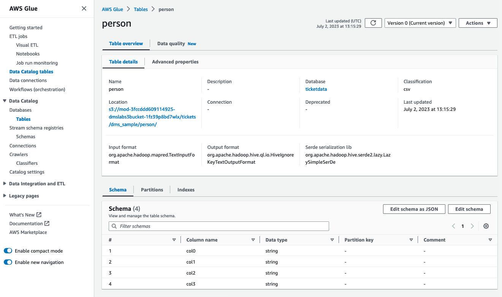
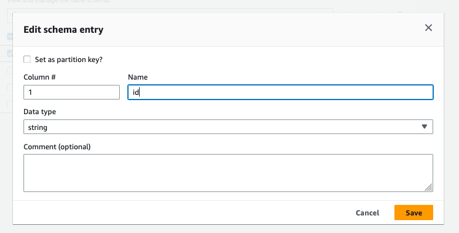
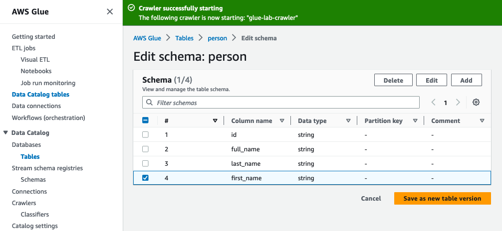

# Lab3-2: Data Validation Exercise

PART A: Data Validation and ETL - Data Validation Exercise

이전 실습에서 Amazon Glue Crawler로 생성한 _Data Catalog_ 내에 Table을 검토해 봅니다.

#### 1. _ticketdata_ 데이터베이스의 테이블 섹션에서 중간쯤 위치한 `person` Table을 클릭합니다.

 

일부 테이블(예: person)에는 col0,col1,col2,col3과 같은 column 헤더가 있다는 것을 알 수 있습니다.
헤더가 없거나 crawler가 헤더 유형을 결정할 수 없는 경우에는 default column의 헤더가 지정됩니다.

이 Exercise 에서는 이 문제를 해결하는 방법의 예시로 `person` Table을 사용합니다.

#### 2. 오른쪽 상단에서 _Edit Schema_ 클릭합니다.

 

#### 3. Edit Schema 섹션에서 _col0_(column name)에 체크박스를 선택하고 Edit 모드를 열고 첫번째 column name을 _`id`_ 로 입력합니다.

 

아래 그림과 일치하도록 나머지 column name도 모두 변경하려면 같은 단계를 반복해 줍니다.
`full_name, last_name 및 first_name`
아래와 같이 모두 변경되었다면, 하단의 *_Save as new table version_*을 선택해 줍니다.

 

이렇게 해서 간단히 _Data Validation Exercise_ 하는 법을 수행해 봤습니다.
이제 아래를 클릭하시어, Glue의 주요 기능인 ETL Job을 생성해 보기 위한 Lab으로 이동합니다.

[3-3.Data Validation and ETL - Data ETL Exercise](3-3.dataetlexercise.md)
