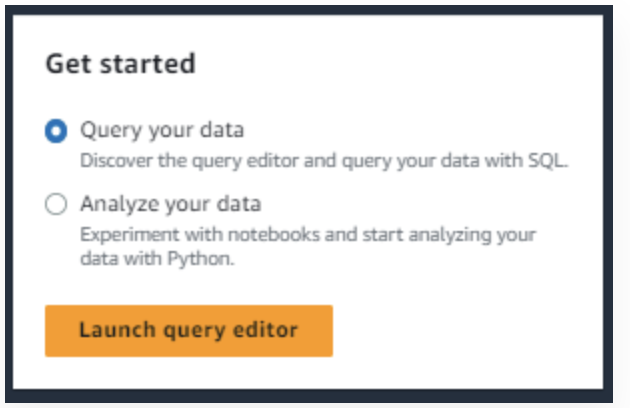
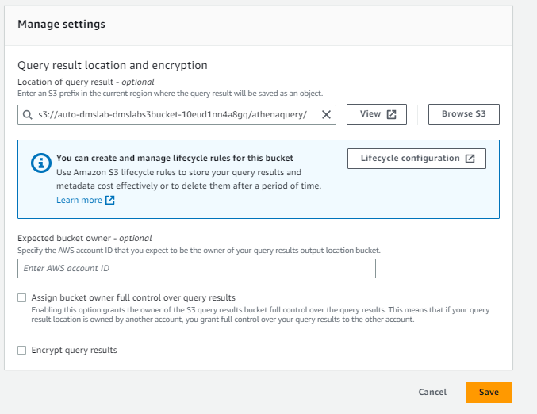
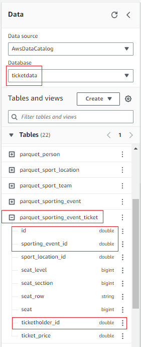
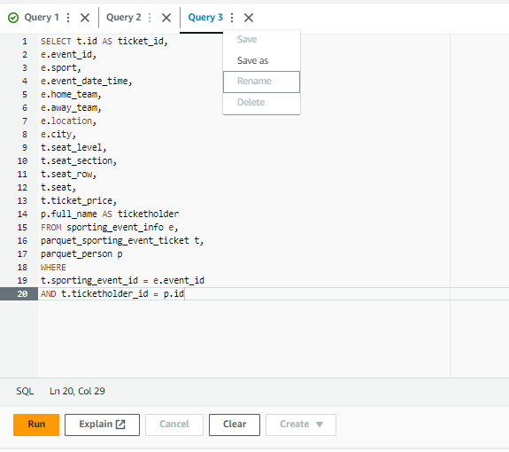
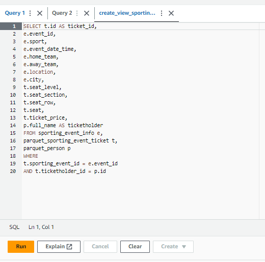
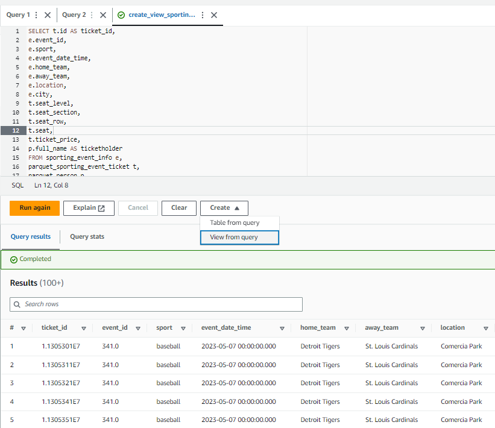
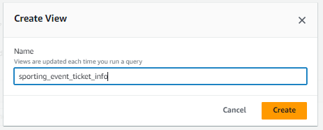
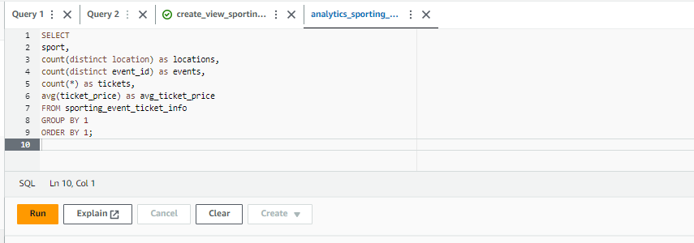
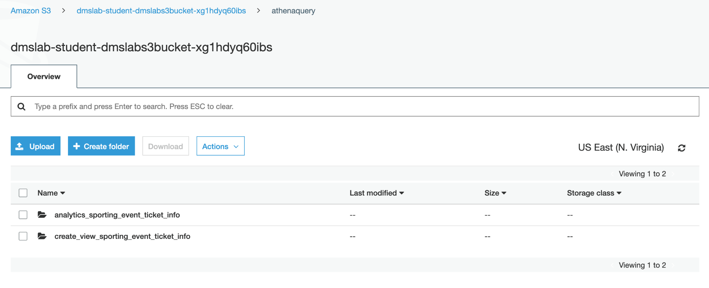

# Lab4-1: Athena로 query 실행해보기

소개

Amazon Athena로 DataLake의 데이터에 ad-hoc query를 실행할 수 있습니다.\
Amazon QuickSight는 import한 데이터의 시각화 기능을 담당합니다.

## 시작하기 전에

Ingestiong with DMS와 Transforming data with Glue ETF 랩을 마치십시오

## 랩의 목표

1. Amazon Athena로 데이터에 query를 실행하고 view를 생성한다
2. Amazon QuickSight로 대시보드를 만든다

## Query Data with Amazon Athena(최근 UI가 일부 변경되어 있으니 강사의 설명에 집중해 주세요.)

#### 1. AWS 콘솔창에서 Athena 검색


***

Athena 사용이 처음이라면, 아래 항목을 수행하시고 아니면 2.로 넘어가세요

#### (1) Get Started 클릭



#### (2) 상단의 'set up a query result location in Amazon S3' 클릭


#### (3) Query result locationaq-필드의 팝업 윈도우에서 Select 아이콘 클릭.dmslabs3bucket (e.g: dmslab-student-dmslabs3bucket-xg1hdyq60ibs) 선택 후, Select 버튼 선택


#### (4) S3 위치 끝에 athenaquery/ 추가 (끝에 "/"를 꼭 넣어주세요!) Save 클릭



#### 2. Query Editor에서 최근 생성한 데이터베이스 선택 e.g.,"ticketdata"

#### 3. "parquet\_sporting\_event\_ticket" 테이블 선택. !주의!: id, sporting\_event\_id, ticketholder\_id의 타입이 _double_ 이어야 합니다.



이제 parquet\_sporting\_event, parquet\_sport\_team, parquet\_sport\_location 테이블을 사용한 query를 실행해볼 것 입니다.

#### 4. 다음 SQL문을 New Query 1 탭에 복사한 후 _Run Query_ 클릭

```SQL
SELECT
e.id AS event_id,
e.sport_type_name AS sport,
e.start_date_time AS event_date_time,
h.name AS home_team,
a.name AS away_team,
l.name AS location,
l.city
FROM parquet_sporting_event e,
parquet_sport_team h,
parquet_sport_team a,
parquet_sport_location l
WHERE
e.home_team_id = h.id
AND e.away_team_id = a.id
AND e.location_id = l.id;
```

Query창 아래에 결과가 보입니다.


#### 5. _Create - Create view from query_ 를 클릭해 _Create view_ 창 실행

#### 6. Name에 ```sporting_event_info```를 입력하고 _Create_ 클릭


생성된 view가 아래와 같이 보입니다.


#### 7. 다음 SQL문을 New Query 3 탭에 입력

```sql
SELECT t.id AS ticket_id,
e.event_id,
e.sport,
e.event_date_time,
e.home_team,
e.away_team,
e.location,
e.city,
t.seat_level,
t.seat_section,
t.seat_row,
t.seat,
t.ticket_price,
p.full_name AS ticketholder
FROM sporting_event_info e,
parquet_sporting_event_ticket t,
parquet_person p
WHERE
t.sporting_event_id = e.event_id
AND t.ticketholder_id = p.id
```



#### 8.Query Editor탭에서 ...(점3개) 클릭 후 Save as 선택, Name : ```create_view_sporting_event_ticket_info```, Description에 임의 내용을 입력 후 Save 클릭


Query Editor창에서 Query 이름이 바뀐 것을 확인할 수 있습니다. Run Query 클릭 



Query창 아래에 결과가 보입니다.



#### 9. _Create - Create view from query_ 클릭

#### 10. Create view 창에서 Name : ```sporting_event_ticket_info``` 입력 후 Create 클릭



#### 11. 다음 SQL문을 New Query 4 탭에 입력

```sql
SELECT
sport,
count(distinct location) as locations,
count(distinct event_id) as events,
count(*) as tickets,
avg(ticket_price) as avg_ticket_price
FROM sporting_event_ticket_info
GROUP BY 1
ORDER BY 1;
```

위와 동일하게 점3개 클릭 후 _Save as_ 클릭, Name : ```analytics_sporting_event_ticket_info```, Description에 임의 내용 입력 후, Save 클릭 


New Query 4의 이름이 바뀐 것을 확인할 수 있습니다.
Run Query 클릭



약 5초 후 2개 결과값이 리턴됩니다.
1.59GB짜리 CSV파일이었던 데이터가 parquet 전환 뒤, 25MB로 축소되어 스캔됩니다. 


query를 저장하면 실행결과들이 구분되어 저장됩니다. 그렇지 않을시 query 결과가 저장되는 S3버킷내 "Unsaved" 폴더에 저장되는데 S3버킷에 들어가보면 아래와 같이 확인해 볼 수 있습니다. 




#### 다음 [4-2:QuickSight](4-2-createquicksightdashboard.md)에서 QuickSight 대시보드 생성 실습을 시작해 봅니다.🤗
